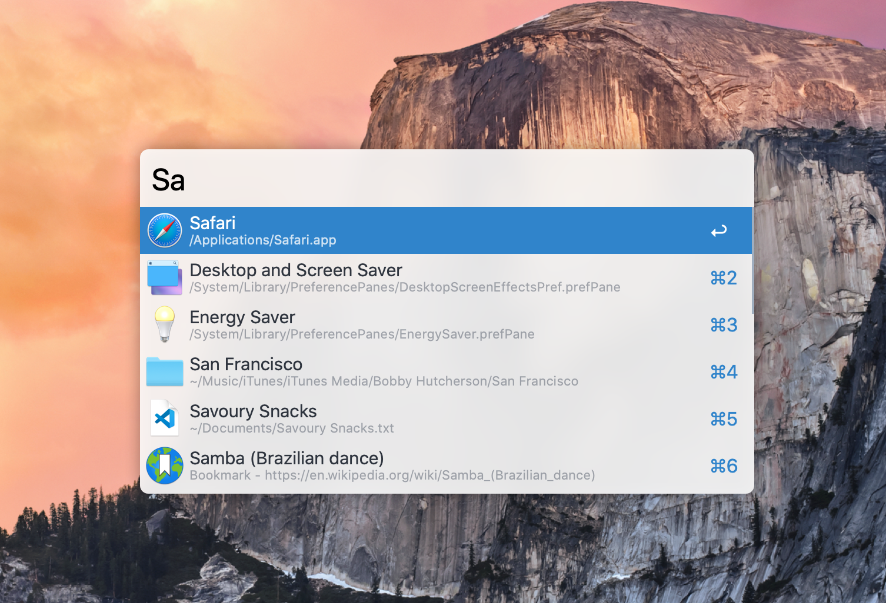
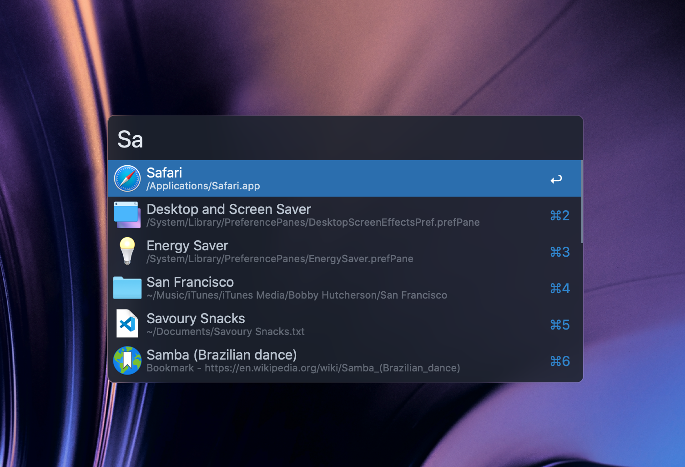

# Moderna Theme for Alfred

A minimal and modern light / dark theme for [Alfred 4](https://www.alfredapp.com).

## How to Install

Install directly from the Alfred site:

- [Moderna Light Theme](https://www.alfredapp.com/extras/theme/HjAyXfYmUv/)
- [Moderna Dark theme](https://www.alfredapp.com/extras/theme/3kLMgkT7RA/)

Or Install Manually:

[Click here to download](https://github.com/namzo/alfred-theme-moderna/archive/master.zip) a zip file of this repo, extract the files and open `Moderna - Light.alfredappearance` and `Moderna - Dark.alfredappearance` to install.

## Info

#### Suggested usage:
Hide the Alfred hat icon in the input by going to  `Appearance > Options > Hide hat on Alfred window`.

#### Note:
Using custom themes requires the [Alfred Powerpack](https://www.alfredapp.com/powerpack/).

## License
[MIT License](https://github.com/namzo/alfred-theme-moderna/blob/master/LICENSE)
